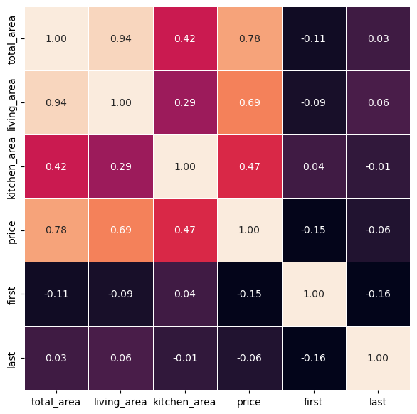

# Построение модели прогнозирования стоимости квартиры в Магнитогорске и определение района ее расположения методом кластеризации

## *Описание проекта*
Целью проекта было построение модели прогнозирующей стоимость квартиры в городе Магнитогорск по ее параметрам. Затем необходимо было провести кластеризацию данных по районам их расположения.

### <a id="content">*Содержание*</a>

[Описание данных](#data)

[Модель регрессии](#regression)

[Кластеризация](#clasterization)

## <a id="data">*Данные*</a>
В качестве исходных данных была использована информация с сайта  [www.citystar.ru](https://www.citystar.ru). На указанном сайте есть таблица с характеристиками квартир.

>Среди приведенных данных есть колонки:
>+ тип квартиры (количество комнат, тип планировки)
>+ район
>+ адрес
>+ этаж (этаж квартиры и этажность дома)
>+ площадь объекта: общая, жилая, кухни (в м²)
>+ примечание (описание от агента)
>+ цена (в тыс. руб.)
>+ контакты агента

Изначально был собран 451 элемент. Эти данные были загружены в базу данных.

Перспективными данными, с точки зрения влияния на стоимость, может быть информация о *типе квартиры*, однако данных о планировке слишком мало и восстановить их проблематично. Поэтому в работе было использовано только количество комнат.

Информация об *этажности* была преобразована в четыре признака:
- этаж, на котором расположена квартира,
- общее количество этажей в здании,
- является ли этаж первым,
- является ли он последним.

Данные о *районе* изначально были плохо заполнены (всего 252 значения), но была информация об адресе, которую можно использовать для дозаполнения отсутствующих значений. Для этого с сайта [index.kodifikant.ru](https://index.kodifikant.ru/ru/7400000900000) были собраны данные о почтовых индексах (точнее ОКАТО)  улиц города и принадлежности отделений связи разным районам. Затем адреса объектов с незаполнеными данными проверялись по перечню адресов каждого района. Данные, для которых не удалось восстановить район, были удалены из выборки.

Таким образом для дальнейшей работы были выбраны данные о количестве комнат, районе, этажности, площади и цене объекта.

---

Далее был проведен разведочный анализ данных, в ходе которого отмечено:
+ Не все районы представлены равномерно: мало значений для Ленинский (левый берег) и Орджоникидзевский (левый берег).
+ Было 3 объекта с общей площадью больше 150м².  Их отбросили для получения более правильного распределения признака.
+ 23 незаполненных значения признака жилая площадь. Их заполнили средним значением этого признака для каждого квартиля, сгруппировав и разбив выборку по признаку общая площадь.
+ Пропуски данных в признаке площадь кухни заполнены значением моды в данном признаке (6.0м²).

В результате проверки скоррелированности признаков видна сильная корреляция жилой и общей площадей. При построении моделей признак общая площадь не учитывали.

В результате получено ***364*** полностью заполненных элемента данных.

## <a id="regression">*Построение модели регрессии*</a>
[К содержанию](#content)
### *Описание работы*
Работа состояла из следующих этапов:
    1) разбиение выборки на тренировочную и тестовую
Использовано разбиение 80/20 со стратификацией по району.
    2) кодировка категориальных признаков: количество комнат и район
Оба признака имеют небольшое число классов, поэтому использован OneHotEncoder
    3) шкалирование числовых признаков
Для преобразования использован StandardScaler
    4) построение модели линейной регрессии
Для построения использована линейная регрессия из sklearn. Ее результаты приняты за отправную точку.
    5) использование метода опорных векторов и подбор оптимальных параметров
Была использована реализация SVR из sklearn. Подбор оптимальных параметров проводили с использованием optuna.
    6) построение градиентного бустинга
В работе использован CatBoostRegressor с параметрами по умолчанию. В данном случае подбор параметров не проводили, так как модель сама подбирает оптимальные (согласно документации и проверено на практике).
    7) построение и оптимизация случайного леса
Модель случайного леса также была взята стандартная из sklearn и подбор параметров осуществлялся аналогично SVR
    8) анализ эффективности моделей и сравнение влияющих признаков

## <a id="clasterization">*Кластеризация*</a>
[К содержанию](#content)

