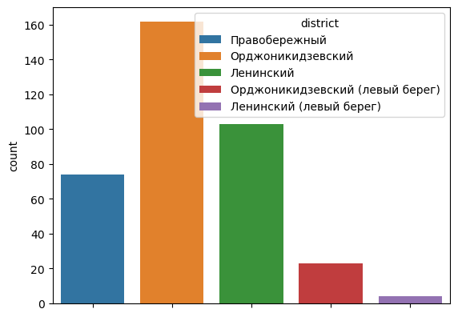
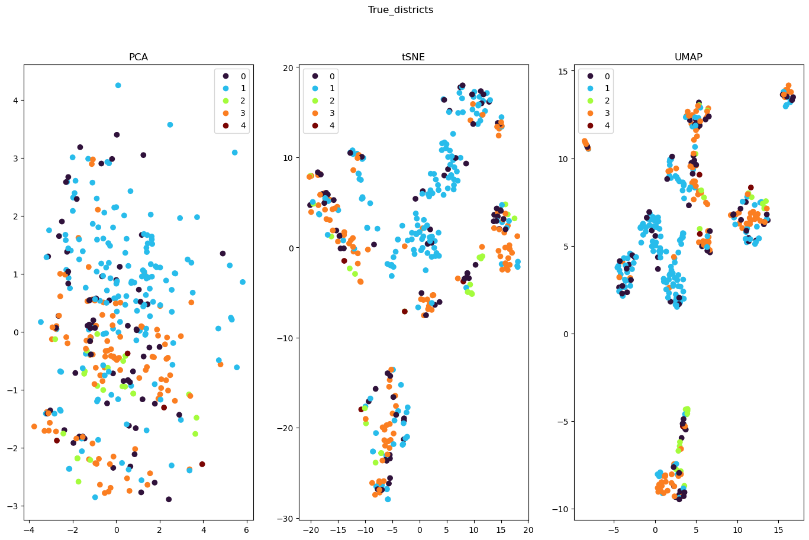
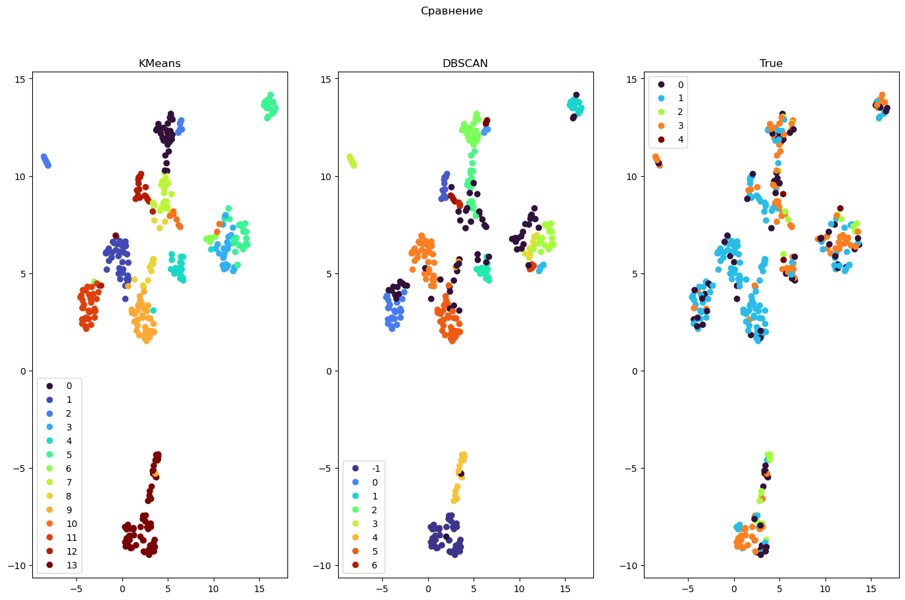
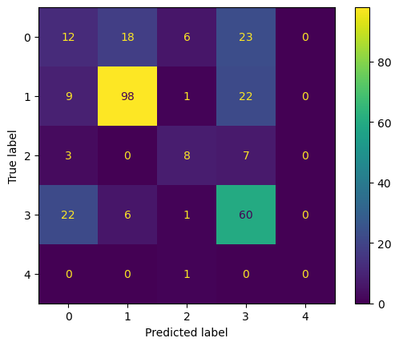
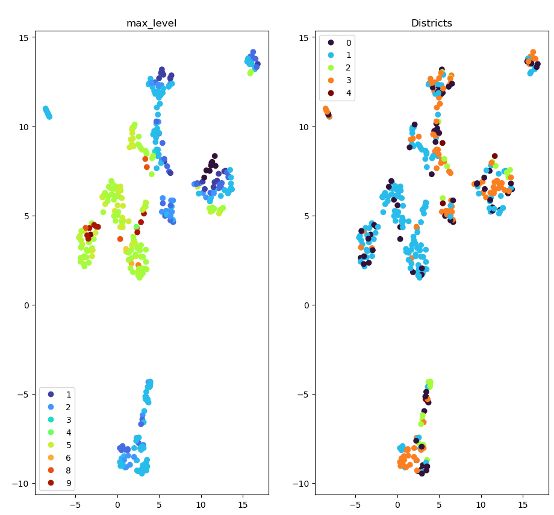

# Построение модели предсказания стоимости квартиры в Магнитогорске и определение района ее расположения методом кластеризации

## *Описание проекта*
Целью проекта было построение модели прогнозирующей стоимость квартиры в городе Магнитогорск по ее параметрам. Затем необходимо было провести кластеризацию данных по районам их расположения.

### <a id="content">*Содержание*</a>

[Описание данных](#data)

[>Модель регрессии](#regression)

[Результаты](#regression_result)

[>Кластеризация](#clasterization)

[Результаты](#clasterization_result)

## <a id="data">*Данные*</a>
В качестве исходных данных была использована информация с сайта  [www.citystar.ru](https://www.citystar.ru). На указанном сайте есть таблица с характеристиками квартир.

>Среди приведенных данных есть колонки:
>+ тип квартиры (количество комнат, тип планировки)
>+ район
>+ адрес
>+ этаж (этаж квартиры и этажность дома)
>+ площадь объекта: общая, жилая, кухни (в м²)
>+ примечание (описание от агента)
>+ цена (в тыс. руб.)
>+ контакты агента

Изначально был собран 451 элемент ([тетрадка](https://github.com/Na-ta-ly/Apartment_prices/blob/main/Data_preprocessing%2BEDA.ipynb)).

Перспективными данными, с точки зрения влияния на стоимость, может быть информация о *типе квартиры*, однако данных о планировке слишком мало и восстановить их проблематично. Поэтому в работе было использовано только количество комнат.

Информация об *этажности* была преобразована в четыре признака:
- этаж, на котором расположена квартира,
- общее количество этажей в здании,
- является ли этаж первым,
- является ли он последним.

Данные о *районе* изначально были плохо заполнены (всего 252 значения), но была информация об адресе, которую можно использовать для дозаполнения отсутствующих значений. Для этого с сайта [index.kodifikant.ru](https://index.kodifikant.ru/ru/7400000900000) были собраны данные о почтовых индексах (точнее ОКАТО) для улиц города и принадлежности отделений связи разным районам. Затем адреса объектов с незаполнеными данными проверялись по перечню адресов каждого района. Данные, для которых не удалось восстановить район, были удалены из выборки.

Таким образом для дальнейшей работы были выбраны данные о количестве комнат, районе, этажности, площади и цене объекта.

---

Далее был проведен разведочный анализ данных, в ходе которого отмечено:
+ Не все районы представлены равномерно: мало значений для Ленинский (левый берег) и Орджоникидзевский (левый берег) - 4 и 21 элемент соответственно.
+ Было 3 объекта с общей площадью больше 150м².  Их отбросили для получения более правильного распределения признака.
+ 23 незаполненных значения признака жилая площадь. Их заполнили средним значением этого признака для каждого квартиля, сгруппировав и разбив выборку по признаку общая площадь.
+ Пропуски данных в признаке площадь кухни заполнены значением моды в данном признаке (6.0м²).

В результате проверки скоррелированности признаков видна сильная корреляция жилой и общей площадей. При построении моделей признак общая площадь не использовали.

В результате получено ***364*** полностью заполненных элемента данных.

## <a id="regression">*Построение модели регрессии*</a>
[К содержанию](#content)
### *Описание работы*
Работа состояла из следующих этапов ([тетрадка](https://github.com/Na-ta-ly/Apartment_prices/blob/main/Regression_model.ipynb)):

#### *1. Разбиение выборки на тренировочную, валидационную и тестовую*

>Для получения тренировочной выборки использовали разбиение 80/20 со стратификацией по району. Затем оставшиеся 20% данных были разбиты на тест и валидацию, но уже без стратификации из-за малого количества данных. 

#### *2. Кодировка категориальных признаков: количество комнат и район*

>Количество комнат рассмотрим как категориальный признак, потому что некоторые квартиры могут цениться непропорционально количеству комнат в них.
>
>Оба признака имеют небольшое число классов, поэтому использован OneHotEncoder

#### *3. Шкалирование числовых признаков*

>Для преобразования использован StandardScaler

#### *4. Построение модели линейной регрессии*

>Для построения использована линейная регрессия из sklearn. Ее результаты приняты за отправную точку.

#### *5. Использование метода опорных векторов и подбор оптимальных параметров*

>Была использована реализация SVR из sklearn. Подбор оптимальных параметров проводили с использованием optuna, но из-за высокой длительности процесса проводили только 100 попыток. 

#### *6. Построение градиентного бустинга*

>В работе использован CatBoostRegressor с параметрами по умолчанию. В данном случае подбор параметров не проводили, так как модель сама подбирает оптимальные (согласно документации и проверено на практике).

#### *7. Построение и оптимизация случайного леса*

>Модель случайного леса также была взята стандартная из sklearn и подбор параметров осуществлялся аналогично SVR, но попыток было 1000.

#### <a id="regression_result">*8. Анализ эффективности моделей и сравнение влияющих признаков*</a>

В качестве показателей эффективности моделей были выбраны MSE, MAE и MAPE.

Полученные результаты представлены в таблице.

<table>
    <tr>
        <th></th>
        <th>LinearRegression (baseline)</th>
        <th>SVR (из коробки)</th>
        <th>SVR (optuna)</th>
        <th>CatBoostRegressor (из коробки)</th>
        <th>RandomForest (из коробки)</th>
        <th>RandomForest (optuna)</th>
    </tr>
    <tr>
        <td>MSE</td>
        <th>543019.0</th>
        <th>2224278.93</th>
        <th>1851270.63</th>
        <th>458585.83</th>
        <th>473781.81</th>
        <th>476920.29</th>
    </tr>
    <tr>
        <td>MAE</td>
        <th>508.56</th>
        <th>1214.29</th>
        <th>1094.79</th>
        <th>450.45</th>
        <th>489.43</th>
        <th>456.5</th>
    </tr>
    <tr>
        <td>MAPE</td>
        <th>26.67</th>
        <th>44.52</th>
        <th>41.61</th>
        <th>22.19</th>
        <th>21.81</th>
        <th>22.0</th>
    </tr>
</table>

Хочется отметить, что в случае случайного леса оптимизация параметров модели вызвала даже ухудшение качества. Это связано с малым количеством данных и, как следствие, разбросом между тестовой и валидационной выборками.

***Итог:*** нам удалось улучшить качество базовой модели на 4.86% MAPE. Кроме того, неудивительным результатом стала высокая эффективность ансамблей.
Интересно отметить, что район Орджоникидзевский (левый берег) ценится немного выше остальных.

В качестве окончательного варианта была использована модель случайного леса с параметрами по умолчанию.
Для дополнительного тестирования модели использовались данные о трех квартирах, взятые с сайта avito. Результаты получились следующие (истинная цена – цена, предсказанная моделью): 1850 – 1958, 2950 – 2898 и 4900 – 4201. Для этих данных MAPE составила 7.29%. А MAE - 286.27 тыс.руб.

## <a id="clasterization">*Кластеризация*</a>
[К содержанию](#content)

Для данной задачи ключевыми данными являются районы расположения квартир. При исследовании данных было обнаружено малое количество объектов, относящихся к районам Орджоникидзевский (левый берег) (21 объект) и Ленинский (левый берег) (4 элемента).

Для кластеризации были использованы все признаки, за исключением описания: общая площадь, жилая площадь, площадь кухни, цена, количество комнат, этаж квартиры, является ли он первым или последним, этажность дома.

### *Описание работы*
Работа состояла из следующих этапов:
#### *1. Кодирование категориальных данных*

>Районы закодированы вручную:
>+ Правобережный – 0,
>+ Орджоникидзевский – 1,
>+ Орджоникидзевский (левый берег) – 2,
>+ Ленинский – 3,
>+ Ленинский (левый берег) – 4.

#### *2. Шкалирование числовых признаков*

>Для преобразования использован StandardScaler

#### *3. Снижение размерности данных*

>Для визуальной оценки качества полученных кластеров, будем использовать отображение данных на плоскость. С этой целью необходимо снизить размерность исходных данных.
>
>Для преобразования использованы методы PCA, t-SNE из sklearn и метод UMAP. Во всех случаях снижение производили до 2-х компонентов для отображения данных на плоскости. Подбор параметров для  UMAP осуществлялся визуально до получения наиболее чистых кластеров.
>
>На представленных рисунках видно, что получить визуально чистые группы не удалось. На них показан истинный район для каждого элемента исходных данных.

#### *4. Кластеризация методами аггломеративной кластеризации и k-средних*

>Реализации обоих методов взяты из  sklearn.
>
>Для методов KMeans и аггломеративной кластеризации пробовали подобрать оптимальное число кластеров методами "локтя" и минимизацией силуэтного коэффициента, но на графиках нет ни очевидного "локтя", ни значительного минимума силуэтного коэффициента. Поэтому эмпирическим подбором выбрали значения 13 кластеров для k-средних, и 14 кластеров для аггломеративной кластеризации. Эти значения показали наилучшую схожесть с истинным распределением по районам.
>
>И в целом, оба метода показали близкие картины разбиений.

#### *5. Кластеризация методом DBSCAN*

>В данном случае подбор параметров проводился вручную, визуальным сравнением с реальным распределением данных по районам. 
>
>

#### <a id="clasterization_result">*6. Анализ эффективности кластеризации*</a>

>DBSCAN дал более реалистичную картину. Поэтому для анализа были использованы его результаты.
>
>Сначала каждому кластеру из разбиения DBSCAN поставили в соответствие истинный район квартиры. Сопоставление делали по преобладающему району для каждого кластера.
>
>Затем просуммировали все кластеры для каждого района и оценили результат критериями классификации. Accuracy_score составил 0.60.
>
>Если по классу 1 и 3 результаты еще приемлемые, то класс 0 модель не находит вообще. Это видно и по визуальному распределению. Даже на рисунке с кластерами исходных данных, кластер 0 нигде не выделяется в отдельный. И если кластеры 2 и 4 хотя бы малочисленные, то в 0 элементов достаточно много, однако он очень неспецифический.
>
>
>
><table>
>    <tr>
>        <th>class</th>
>        <th>precision</th>
>        <th>recall</th>
>        <th>f1-score</th>
>        <th>support</th>
>    </tr>
>    <tr>    
>        <th>0</th>
>        <th>0.26</th>
>        <th>0.20</th>
>        <th>0.23</th>
>        <th>59</th>
>    </tr>
>    <tr>    
>        <th>1</th>
>        <th>0.80</th>
>        <th>0.75</th>
>        <th>0.78</th>
>        <th>130</th>
>    </tr>
>    <tr>    
>        <th>2</th>
>        <th>0.47</th>
>        <th>0.44</th>
>        <th>0.46</th>
>        <th>18</th>
>    </tr>
>    <tr>    
>        <th>3</th>
>        <th>0.54</th>
>        <th>0.67</th>
>        <th>0.60</th>
>        <th>89</th>
>    </tr>
>    <tr>    
>        <th>4</th>
>        <th>0.00</th>
>        <th>0.00</th>
>        <th>0.00</th>
>        <th>1</th>
>    </tr>
></table>
>
>В связи с малым количеством данных классов 2 (Орджоникидзевский (левый берег)) и 4 (Ленинский (левый берег)), попробовали объединить их с классами 1 (Орджоникидзевский) и 3 (Ленинский). Accuracy_score вырос незначительно.
>
>После анализа наиболее информативного признака, было выявлено что этажность дома наилучшим образом отражает район расположения квартиры. И действительно, наблюдается некоторая разница по типу застройки районов города. И, хотя этот признак работает только для конкретного случая, он помогает предположить район по характеристикам квартиры.
>
>
>
>Надо отметить неплохое соответствие 4-х и 5-и этажных домов району 1 (Орджоникидзевский) и, наоборот, плохое выделение района 0 (Правобережный).

---

***Итог:*** в результате работы была построена модель предсказывающая район расположения квартир, кластеризуя данные на основе параметров стоимость, количество комнат и этаж. Несмотря на неочевидность такой зависимости, для 2-х наиболее крупных классов  (Орджоникидзевский и Ленинский) модель даже дает точность (precision) более 0.50.

Есть проблема с классом 0 (Правобережный): его не удалось выделить в отдельный кластер нигде. Но это можно объяснить, вероятно, тем что в этом районе присутствуют здания разной этажности, что является основным признаком при кластеризации.

Также более мелкие классы не очень чисто выделились, но тут уже можно говорить о малом числе экземпляров. Возможно, при большем количестве данных, можно было бы их выделить отдельные кластеры. 

Кроме того, в нашем случае этажность - основной признак для разделения, такой подход не является универсальным и не для каждого населенного пункта будет эффективен.
